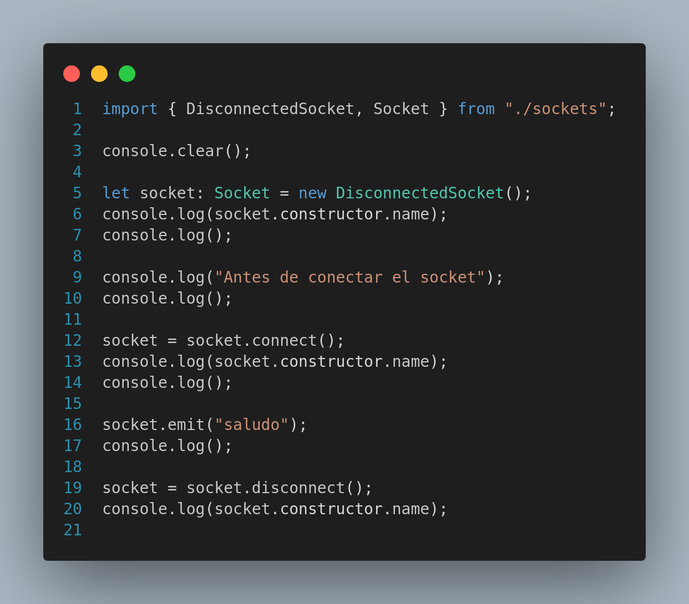

# Ejemplo de Type-Driven Development

Luego de ver, en varias ocasiones, el vídeo [Si usas TYPESCRIPT, DEBERÍAS tener MENOS TESTS][si usas typescript, deberías tener menos tests] del canal [BettaTech][betta-tech], me quedé pensando cómo poder reducir el consumo de recursos por la creación de multiples instancias de las clasas involucradas, así probé y este fue el resultado.

## De qué se trata este proyecto?

Este es un proyecto simple en nodejs y TypeScript con el fin de aprender a utilizar **_Type-Driven Development_**, en este caso se crea una clase que simula un socket y el cual no permite emitir mensajes hasta que se haya conectado.

## Estructura de archivos

```sh
└── type-driven-development
  ├── README.md
  ├── images
    └── index.ts-1.png
  └── node_modules
  ├── package-lock.json
  ├── package.json
  └── src
    ├── index.ts
    └── sockets.ts

```

El proyecto en cuestión, simula la conexión vía socket,

El proyecto está dividido en dos archivos principales **_src/index.ts_**, que contine el código que prueba las clases y **_src/sockets.ts_**, contiene el código de las clases.



Si eliminamos el comentario de la línea **socket.emit("hola");**, veremos que la misma se resalta son un subrayado en rojo y al posicionar el cursos sobre la palabra **_emit_** veremos el mensaje **_Property 'emit' does not exist on type 'IDisconnectedSocket'.ts(2339)_**, el motivo, como podemos ver en el método **_disconnect_**, éste retorna una instancia de la clase que implementa la interfaz **_DisconnectedSocket_**, la cual no contiene el método **_emit_**

```sh
# Ejecutamos
npm start
```

Esto nos genera la siguiente salida

```sh
DisconnectedSocket

Antes de conectar el socket

Conectando el socket
Se conectó el socket
ConnectedSocket

Se emitió el evento: saludo

Se desconectó el socket
DisconnectedSocket

```

[si usas typescript, deberías tener menos tests]: https://www.youtube.com/watch?v=K--Lmy8qUCQ&t=4s
[betta-tech]: https://www.youtube.com/@BettaTech
